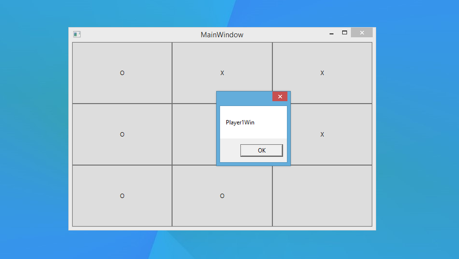

# TicTacToe
### About
A simple game of TicTacToe, with a standard 3x3 playing field and support for playing against an AI.

### Installation Instructions
Currently, to install the game you have two options:

#### Option 1 - Building from source
Open up the file `TicTacToe.sln` in Visual Studio (or any other .NET IDE), and build all the projects.

To use the GUI frontend, run the `TicTacToe.WpfApp` project.

#### Option 2 - Download the binaries
This method of installation is currently under active development, and will be available soon.

### FAQ
##### Can I use this on Windows/Linux/Mac?
The only extensively tested system is Windows (any version with .NET support should work). Linux might work with some help from `wine` or `mono`.

##### What are your plans on incorporating feature X?
If you would like to see a feature implemented, create an issue (in the form of a feature request), and it will be reviewed :)
